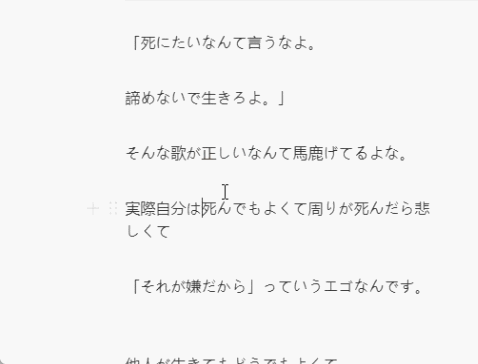
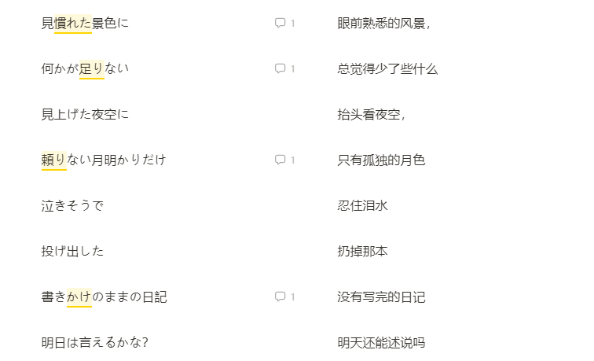
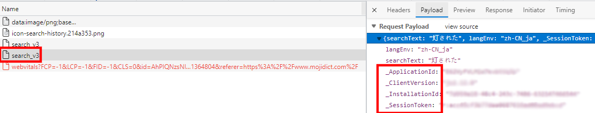
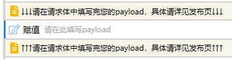

# Notion翻译(MOJI)

| [Github首发页](https://github.com/StanHustler/Quicker-scripts/Notion翻译(MOJI)/) | [Quicker动作库页](https://getquicker.net/Sharedaction?code=0577f610-1d14-45c9-7caf-08d9de3be7af) |
| :----------------------------------------------------------: | ------------------------------------------------------------ |

|                            适用于                            |
| :----------------------------------------------------------: |
| Notion | 

## 功能介绍

在notion中选中文字，然后使用本脚本，即可自动翻译并进行comment

> API使用的是本人较常使用的MOJI词书，如果有建议和反馈请来[GitHub发issue](https://github.com/StanHustler/Quicker-scripts/issues)

### 图片演示

## 配置

安装完成后，需要进行配置才能正常使用，具体如下：

1. 打开[Moji官网](https://www.mojidict.com/)

2. 按下`F12`并选中**Network** (也可以用任何熟悉的抓包工具，burp等)

3. 在网页搜索框中随便输入

4. 在`search_v3`中选中**Payloads**，获取到*_ApplicationId*,*_ClientVersion*，*_InstallationId*，*_SessionToken*
   

5. 在Quicker面板中找到本脚本右键选中`编辑`，并在此处

   

   双击并填入第四步中得到的信息

6. 配置完成啦👻去notion试试吧，有意见和建议请[来GitHub的issue页](https://github.com/StanHustler/Quicker-scripts/issues)联系我
